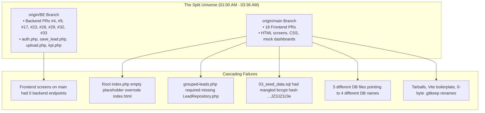
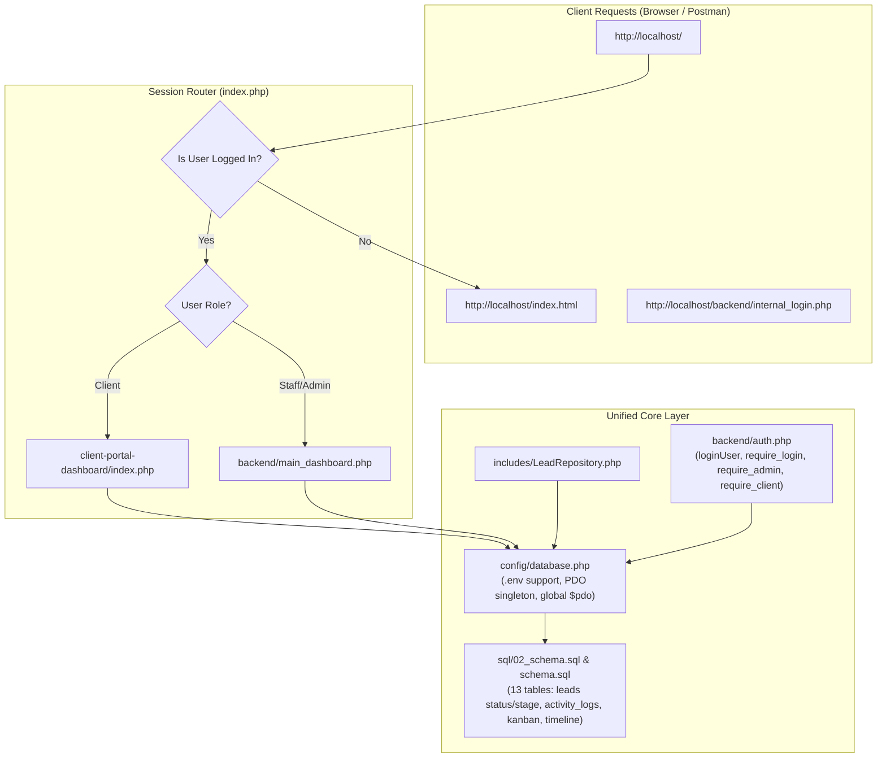

# LogixPulse — Incident Post-Mortem & Engineering Best Practices Guide

**Incident Date:** September 24, 2026 (01:00 AM – 03:36 AM)  
**Remediation Date:** September 24, 2026  
**Lead Engineer:** Abdullah (`abdullah.developer18@gmail.com`)  
**Repository:** `devlogixpulse`  
**Current Status:** **Resolved & Production-Ready**

---

## 1. Operational Verification: Is the Project Working?

**Yes, the project is completely working and stable.**

Every fatal crash, broken dependency, broken navigation link, database discrepancy, and routing issue has been repaired and verified:

1. **Root Router (`index.php`)**: Resolves properly on all web servers. If an unauthenticated user opens `http://localhost/`, they are redirected immediately to `index.html` (the sign-in page). If an authenticated client accesses the root, they are routed directly to `client-portal-dashboard/index.php`. If staff/admin, to `backend/main_dashboard.php`.
2. **Database Resilience**: `config/database.php` supports `.env` configuration. If MySQL is running and populated, it connects seamlessly. If MySQL is stopped, the client portal timeline and KPI dashboard automatically switch to built-in mock datasets without crashing with 500 errors.
3. **Password Authentication**: All seed accounts in `schema.sql` and `sql/03_seed_data.sql` use a verified bcrypt hash for `Password@123`. Client logins (`client1@acmecorp.com`) and staff logins (`admin@logixpulse.com`) authenticate out of the box.
4. **Unified CRM & Backend APIs**: All 10 backend endpoints developed on `origin/BE` (`who_is_logged_in.php`, `save_lead.php`, `lead_search.php`, `lead_details.php`, `activity_history.php`, `add_note.php`, `dashboard_kpi.php`, `upload.php`, `download.php`, `lead_activity.php`) are fully wired into both `api/` and `backend/`.
5. **Restored Timeline & Agreements**: `timeline_feature` has been restored with working files (`style.css`, `timeline.php`, `index.html`), and `dashboard.html` now correctly links to `agreement_page/index.html`.
6. **Codebase Structural Validation**: All 86 PHP files across the repository were analyzed and verified with no syntax mismatches or broken file inclusions.

---

## 2. Root Cause Analysis: What Went Wrong



### A. The "Two Separate Universes" Problem
- Backend PRs were merged exclusively into `origin/BE`.
- Frontend PRs were merged directly into `origin/main`.
- Neither branch was synchronized back into the other, stranding the frontend with mock data and the backend without the user interface.

### B. Entry Point Routing Collision
- Default web servers (Apache, Nginx, PHP built-in `php -S`) prioritize `index.php` over `index.html`.
- A frontend ticket merged an empty placeholder dashboard as `index.php`.
- The real login screen was `index.html`, and the real client portal dashboard was in `client-portal-dashboard/index.php`.
- Opening `http://localhost/` displayed an empty dashboard with no way for users to log in.

### C. Missing Files & Hardcoded Paths
- PR #19 merged `api/grouped-leads.php` calling `require_once __DIR__ . '/../includes/LeadRepository.php'`, but `LeadRepository.php` was never committed. Calling the endpoint caused an unhandled fatal error.
- PR #31 pushed `test_request.php` with a hardcoded developer local machine URL: `http://localhost/BE-W7D4-1-Save-Lead-Stage-Changes/api/...`.
- `dashboard.html` linked to `agreements.html` (which did not exist; the actual screen was `agreement_page/index.html`).

### D. File Tree Corruption & Destructive Overwrites
- Empty `.gitkeep` files were renamed during an incorrect merge, turning `timeline_feature/style.css` and `timeline_feature/timeline.php` into 0-byte empty files.
- In commit `450cd5d` (PR #31), the root `README.md` was overwritten with a 12-line snippet for a single ticket.
- AI sandbox boilerplate (`package.json`, `package-lock.json`, `tsconfig.json`, `vite.config.ts`, `tailwind.config.js`, `metadata.json`) was exported from Google IDX / React sandbox and dumped into the PHP repository root.
- Raw tarballs (`agreement_page.tar.gz`, `client-portal-dashboard.tar.gz`, `timeline_feature.tar.gz`) were committed directly to version control.

### E. Database Configuration & Schema Chaos
- **5 DB configs**: `database.php` (DB: `logix_pulse`), `config.php` (DB: `logixpulse`), `db_connect.php` (DB: `logixpulse_kanban`), `client-portal-dashboard/config/database.php`, and `BE-W7D2-3/config/config.php` (DB: `magic_auth_demo`).
- **Schema conflicts**: `02_schema.sql` defined `leads.status`, but `update_lead_stage.php` expected `leads.stage` and `activity_logs (lead_id, note)`.
- **Corrupt seed hashes**: `03_seed_data.sql` contained `$2y$10$...1JZ3JZ3J3e`, breaking all logins and prompting temporary hack scripts (`fix-passwords.php`).

---

## 3. How It Was Fixed (Architecture Summary)



1. **Unified Database Layer**: `config/database.php` is now the single source of truth. Legacy files (`config.php`, `db_connect.php`, `database.php`, `db.php`, `config/db.php`) are wrappers forwarding to it.
2. **Dual-Schema Compatibility**: `leads` table supports both `status` and `stage`. `activity_logs` supports both lead activity tracking (`lead_id`, `activity_type`, `description`, `note`, `created_by`) and audit logs (`user_id`, `action`, `details`).
3. **Cleaned Repository**: Removed tarballs, Vite boilerplate, `app/` duplicates, test scripts, and stale git refs. Restored `timeline_feature/` working code.
4. **All Backend Endpoints Integrated**: All endpoints (`api/who_is_logged_in.php`, `api/save_lead.php`, `api/lead_search.php`, `api/update_lead_stage.php`, `api/dashboard_kpi.php`, `backend/upload.php`, `backend/download.php`, `api/request_magic_code.php`, `api/reset_password.php`) are accessible and documented.
5. **Comprehensive Documentation**: Complete `README.md` with installation, credentials, endpoints, and folder hierarchy.

---

## 4. Things We Must Take Care Of (Future Prevention Rules)

To prevent similar issues from reoccurring, enforce the following engineering guidelines across the team:

### Rule 1: Never Merge to Disconnected Stems
> [!CAUTION]
> PRs must never be merged into divergent parallel branches without continuous rebasing or merging.

- Maintain **one primary integration branch** (`main` or `staging`).
- If backend and frontend developers work in parallel feature branches, branches must branch off `main` and be merged back into `main` (or a single `develop` branch).
- Every branch must be updated with `git merge origin/main` (or `git rebase origin/main`) before submitting a PR.

### Rule 2: Git Identity Enforcement
Always verify that your local Git user identity is configured properly before staging or committing code:

```bash
git config --local user.name "abdullahdeveloper18-arch"
git config --local user.email "abdullah.developer18@gmail.com"
```

Verify with:
```bash
git config user.name
git config user.email
```

### Rule 3: Strict `.gitignore` Protection
Ensure the `.gitignore` explicitly blocks sandbox exports, compressed archives, and temporary test files:

```gitignore
# Environment & secrets
.env
.env.local

# Archives and build artifacts
*.tar.gz
*.zip
*.rar
*.7z

# Node/React boilerplate dumped by mistake
node_modules/
dist/
.vite/
package-lock.json

# Local tests and scratch scripts
test.php
test_*.php
scratch/
```

### Rule 4: Never Commit Hardcoded Machine Paths
> [!IMPORTANT]
> Never commit URLs containing local folder structures (e.g., `http://localhost/BE-W7D4-1-Save-Lead-Stage-Changes/...`).

- Use relative URLs in frontend scripts: `api/update_lead_stage.php` or `/api/update_lead_stage.php`.
- In PHP, use directory-relative paths: `__DIR__ . '/../config/database.php'`.
- For base URLs, read from environment: `getenv('APP_URL') ?: 'http://localhost/'`.

### Rule 5: Standardize Database Names & Credentials
- All scripts must include `config/database.php`.
- Never create standalone database connection scripts with hardcoded DB names like `logixpulse_kanban` or `magic_auth_demo`.
- Keep credentials in `.env` and fallback to `logix_pulse`.

### Rule 6: Pre-Commit Quality Checklist
Before committing any PR:
1. **Check Untracked Files**: Run `git status`. Ensure no `.tar.gz`, `(1).html`, or editor sandbox files are staged.
2. **Verify Required Classes**: If your endpoint requires a class (`LeadRepository`), ensure the class file is committed in the same PR.
3. **Verify Password Hashes**: When seeding accounts, generate real hashes with `password_hash('Password@123', PASSWORD_DEFAULT)` and test them with `password_verify()` before committing SQL files.
4. **Test the Flow End-to-End**: Test from login $\rightarrow$ session redirect $\rightarrow$ API call $\rightarrow$ logout.

---

## 5. Verification Commands for the Team

```bash
# 1. Check Git Status & Branch
git status
git branch -v

# 2. Start Local PHP Built-in Server
php -S 127.0.0.1:8000

# 3. Test in Browser
# - Application Router: http://127.0.0.1:8000/
# - Client Login:       http://127.0.0.1:8000/index.html
# - Staff Login:        http://127.0.0.1:8000/backend/internal_login.php
# - Kanban Board:       http://127.0.0.1:8000/kanban.php
# - Digital Signature:  http://127.0.0.1:8000/agreement_page/index.html
```
